# Pessimistic vs. Optimistic Locking: Comprehensive Guide

## Table of Contents
1. [Introduction](#introduction)
2. [What is Pessimistic Locking?](#what-is-pessimistic-locking)
3. [What is Optimistic Locking?](#what-is-optimistic-locking)
4. [Real-World Analogies](#real-world-analogies)
5. [NestJS Implementation Examples](#nestjs-implementation-examples)
6. [Sequence Diagrams](#sequence-diagrams)
7. [Comparison Table](#comparison-table)
8. [Best Practices & When to Use](#best-practices--when-to-use)
9. [Conclusion](#conclusion)

## Introduction

In concurrent database systems, multiple users or processes often need to access and modify the same data simultaneously. This can lead to **race conditions** and **data inconsistency** if not handled properly. Database locking strategies are essential mechanisms that ensure data integrity and consistency in multi-user environments.

The two primary locking strategies are:
- **Pessimistic Locking**: Assumes conflicts will occur and prevents them by locking resources
- **Optimistic Locking**: Assumes conflicts are rare and detects them when they occur

Understanding when and how to use each strategy is crucial for building robust, scalable applications.

## What is Pessimistic Locking?

### Definition
**Pessimistic Locking** is a concurrency control mechanism that assumes conflicts between concurrent transactions are likely to occur. It prevents conflicts by acquiring exclusive locks on database records before reading or modifying them, ensuring that only one transaction can access the locked resource at a time.

### How It Works
1. **Lock Acquisition**: When a transaction wants to read/modify a record, it first acquires a lock
2. **Exclusive Access**: Other transactions must wait until the lock is released
3. **Lock Release**: The lock is released when the transaction commits or rolls back

### Use Cases
- **Banking Systems**: Account balance updates, money transfers
- **Inventory Management**: Stock quantity updates
- **Booking Systems**: Seat reservations, room bookings
- **Critical Resource Management**: Any scenario where data corruption is unacceptable

### Pros
- **Guaranteed Consistency**: Eliminates race conditions completely
- **Simple Logic**: No need to handle conflict resolution
- **Immediate Conflict Prevention**: Conflicts are prevented before they occur

### Cons
- **Performance Impact**: Locks can cause blocking and reduced throughput
- **Deadlock Risk**: Multiple transactions waiting for each other's locks
- **Scalability Issues**: Heavy locking can limit concurrent access
- **Potential for Lock Contention**: High contention on popular records

### Basic Example (Conceptual)
```typescript
// Pessimistic approach
async function updateAccountBalance(accountId: string, amount: number) {
  const transaction = await sequelize.transaction();
  
  try {
    // This will lock the record until transaction completes
    const account = await Account.findByPk(accountId, {
      lock: true, // Pessimistic lock
      transaction
    });
    
    account.balance += amount;
    await account.save({ transaction });
    
    await transaction.commit();
  } catch (error) {
    await transaction.rollback();
    throw error;
  }
}
```

## What is Optimistic Locking?

### Definition
**Optimistic Locking** is a concurrency control mechanism that assumes conflicts between concurrent transactions are unlikely to occur. Instead of preventing conflicts with locks, it detects conflicts when they happen and handles them appropriately, typically by rejecting one of the conflicting transactions.

### How It Works
1. **Read Without Locking**: Transactions read data without acquiring locks
2. **Version Tracking**: Each record has a version number or timestamp
3. **Conflict Detection**: Before committing, check if the version has changed
4. **Conflict Resolution**: If conflict detected, reject the transaction or retry

### Use Cases
- **User Profile Updates**: Name, email, preferences
- **Content Management**: Blog posts, comments (low conflict scenarios)
- **Configuration Settings**: Application settings that rarely conflict
- **Read-Heavy Applications**: Systems with high read-to-write ratios

### Pros
- **Better Performance**: No blocking, higher throughput
- **No Deadlocks**: Since no locks are held, deadlocks cannot occur
- **Better Scalability**: More concurrent transactions can proceed
- **Resource Efficiency**: No lock management overhead

### Cons
- **Conflict Handling Complexity**: Need to implement retry logic
- **Wasted Work**: Failed transactions need to be retried
- **Not Suitable for High Conflict**: Poor performance when conflicts are frequent
- **Application-Level Logic**: Requires more complex error handling

### Basic Example (Conceptual)
```typescript
// Optimistic approach
async function updateUserProfile(userId: string, newData: any) {
  const user = await User.findByPk(userId);
  const originalVersion = user.version;
  
  // Modify user data
  Object.assign(user, newData);
  user.version = originalVersion + 1;
  
  try {
    // This will fail if another transaction modified the record
    await user.save({
      where: {
        id: userId,
        version: originalVersion // Only save if version matches
      }
    });
  } catch (error) {
    if (error.name === 'OptimisticLockError') {
      throw new Error('Record was modified by another user. Please refresh and try again.');
    }
    throw error;
  }
}
```

## Real-World Analogies

### Pessimistic Locking: The Library Book System
Imagine a university library where students can check out books:

- **The Problem**: Multiple students want the same book
- **Pessimistic Solution**: Only one student can check out the book at a time
- **Process**: 
  1. Student A checks out "Database Design 101"
  2. Student B wants the same book but must wait
  3. Student A returns the book
  4. Now Student B can check it out

**Advantage**: No conflicts - only one person has the book
**Disadvantage**: Student B must wait, reducing library efficiency

### Optimistic Locking: The Google Docs Approach
Consider collaborative document editing:

- **The Problem**: Multiple people editing the same document
- **Optimistic Solution**: Everyone can edit simultaneously, conflicts resolved when they occur
- **Process**:
  1. User A and User B both open the document (version 1)
  2. User A makes changes and saves (creates version 2)
  3. User B makes different changes and tries to save
  4. System detects conflict (User B still has version 1, but current is version 2)
  5. User B sees: "Document was updated by another user. Please review changes."

**Advantage**: Both users can work simultaneously
**Disadvantage**: Conflicts need to be resolved when they occur

## NestJS Implementation Examples

### Pessimistic Locking with Sequelize

```typescript
// user.model.ts
import { Table, Column, Model, DataType, PrimaryKey } from 'sequelize-typescript';

@Table({
  tableName: 'users',
  timestamps: true,
})
export class User extends Model<User> {
  @PrimaryKey
  @Column({
    type: DataType.UUID,
    defaultValue: DataType.UUIDV4,
  })
  id: string;

  @Column({
    type: DataType.STRING,
    allowNull: false,
  })
  email: string;

  @Column({
    type: DataType.DECIMAL(10, 2),
    defaultValue: 0,
  })
  balance: number;

  @Column({
    type: DataType.STRING,
  })
  name: string;
}

// user.service.ts - Pessimistic Locking
import { Injectable } from '@nestjs/common';
import { InjectModel } from '@nestjs/sequelize';
import { User } from './user.model';
import { Sequelize } from 'sequelize-typescript';
import { Transaction } from 'sequelize';

@Injectable()
export class UserService {
  constructor(
    @InjectModel(User)
    private userModel: typeof User,
    private sequelize: Sequelize,
  ) {}

  // Pessimistic locking example - Account balance update
  async updateBalancePessimistic(
    userId: string, 
    amount: number
  ): Promise<User> {
    const transaction = await this.sequelize.transaction({
      isolationLevel: Transaction.ISOLATION_LEVELS.READ_COMMITTED,
    });

    try {
      // Acquire pessimistic lock on the user record
      const user = await this.userModel.findByPk(userId, {
        lock: Transaction.LOCK.UPDATE, // Pessimistic write lock
        transaction,
      });

      if (!user) {
        throw new Error('User not found');
      }

      // Simulate some business logic processing time
      await this.simulateProcessingTime(100);

      // Update balance (this is now safe from concurrent modifications)
      user.balance = Number(user.balance) + amount;
      await user.save({ transaction });

      await transaction.commit();
      return user;
    } catch (error) {
      await transaction.rollback();
      throw error;
    }
  }

  // Pessimistic locking for inventory management
  async reserveInventoryPessimistic(
    userId: string, 
    itemId: string, 
    quantity: number
  ): Promise<boolean> {
    const transaction = await this.sequelize.transaction();

    try {
      // Lock both user and inventory records
      const [user, inventory] = await Promise.all([
        this.userModel.findByPk(userId, {
          lock: Transaction.LOCK.UPDATE,
          transaction,
        }),
        // Assuming we have an inventory model
        this.sequelize.models.Inventory.findByPk(itemId, {
          lock: Transaction.LOCK.UPDATE,
          transaction,
        }) as any,
      ]);

      if (!user || !inventory) {
        throw new Error('User or inventory item not found');
      }

      if (inventory.quantity < quantity) {
        throw new Error('Insufficient inventory');
      }

      // Update inventory
      inventory.quantity -= quantity;
      await inventory.save({ transaction });

      // Could also update user's purchase history here
      // user.purchases.push({ itemId, quantity, timestamp: new Date() });
      // await user.save({ transaction });

      await transaction.commit();
      return true;
    } catch (error) {
      await transaction.rollback();
      throw error;
    }
  }

  private async simulateProcessingTime(ms: number): Promise<void> {
    return new Promise(resolve => setTimeout(resolve, ms));
  }
}
```

### Optimistic Locking with Sequelize

```typescript
// user.model.ts - With version field for optimistic locking
import { Table, Column, Model, DataType, PrimaryKey } from 'sequelize-typescript';

@Table({
  tableName: 'users',
  timestamps: true,
  version: true, // Enables automatic version tracking
})
export class User extends Model<User> {
  @PrimaryKey
  @Column({
    type: DataType.UUID,
    defaultValue: DataType.UUIDV4,
  })
  id: string;

  @Column({
    type: DataType.STRING,
    allowNull: false,
  })
  email: string;

  @Column({
    type: DataType.DECIMAL(10, 2),
    defaultValue: 0,
  })
  balance: number;

  @Column({
    type: DataType.STRING,
  })
  name: string;

  @Column({
    type: DataType.INTEGER,
    defaultValue: 0,
  })
  version: number; // Version field for optimistic locking
}

// user.service.ts - Optimistic Locking
@Injectable()
export class UserService {
  constructor(
    @InjectModel(User)
    private userModel: typeof User,
  ) {}

  // Optimistic locking example - Profile update
  async updateProfileOptimistic(
    userId: string, 
    profileData: { name?: string; email?: string }
  ): Promise<User> {
    const maxRetries = 3;
    let retryCount = 0;

    while (retryCount < maxRetries) {
      try {
        // Read current user data (no locks)
        const user = await this.userModel.findByPk(userId);
        
        if (!user) {
          throw new Error('User not found');
        }

        const currentVersion = user.version;

        // Apply changes
        if (profileData.name) user.name = profileData.name;
        if (profileData.email) user.email = profileData.email;

        // Simulate some processing time
        await this.simulateProcessingTime(50);

        // Attempt to save with version check
        const [affectedRows] = await this.userModel.update(
          {
            name: user.name,
            email: user.email,
            version: currentVersion + 1, // Increment version
          },
          {
            where: {
              id: userId,
              version: currentVersion, // Only update if version matches
            },
          }
        );

        if (affectedRows === 0) {
          // No rows affected means version mismatch (optimistic lock conflict)
          throw new OptimisticLockError('Record was modified by another transaction');
        }

        // Return updated user
        return await this.userModel.findByPk(userId);

      } catch (error) {
        if (error instanceof OptimisticLockError && retryCount < maxRetries - 1) {
          retryCount++;
          console.log(`Optimistic lock conflict, retrying... (${retryCount}/${maxRetries})`);
          
          // Optional: Add exponential backoff
          await this.simulateProcessingTime(Math.pow(2, retryCount) * 100);
          continue;
        }
        
        throw error;
      }
    }

    throw new Error(`Failed to update profile after ${maxRetries} retries due to concurrent modifications`);
  }

  // Optimistic locking with manual version management
  async updateBalanceOptimistic(
    userId: string, 
    amount: number
  ): Promise<User> {
    const user = await this.userModel.findByPk(userId);
    
    if (!user) {
      throw new Error('User not found');
    }

    const originalVersion = user.version;
    const newBalance = Number(user.balance) + amount;

    try {
      const [affectedRows] = await this.userModel.update(
        {
          balance: newBalance,
          version: originalVersion + 1,
        },
        {
          where: {
            id: userId,
            version: originalVersion,
          },
        }
      );

      if (affectedRows === 0) {
        throw new OptimisticLockError(
          'Balance was modified by another transaction. Please refresh and try again.'
        );
      }

      return await this.userModel.findByPk(userId);
    } catch (error) {
      if (error instanceof OptimisticLockError) {
        throw error;
      }
      throw new Error('Failed to update balance');
    }
  }

  private async simulateProcessingTime(ms: number): Promise<void> {
    return new Promise(resolve => setTimeout(resolve, ms));
  }
}

// Custom error class for optimistic locking
export class OptimisticLockError extends Error {
  constructor(message: string) {
    super(message);
    this.name = 'OptimisticLockError';
  }
}
```

### Pessimistic Locking with TypeORM

```typescript
// user.entity.ts
import { Entity, PrimaryGeneratedColumn, Column, VersionColumn } from 'typeorm';

@Entity('users')
export class User {
  @PrimaryGeneratedColumn('uuid')
  id: string;

  @Column()
  email: string;

  @Column({ type: 'decimal', precision: 10, scale: 2, default: 0 })
  balance: number;

  @Column({ nullable: true })
  name: string;

  @VersionColumn()
  version: number;

  @Column({ type: 'timestamp', default: () => 'CURRENT_TIMESTAMP' })
  createdAt: Date;

  @Column({ type: 'timestamp', default: () => 'CURRENT_TIMESTAMP' })
  updatedAt: Date;
}

// user.service.ts - Pessimistic Locking with TypeORM
import { Injectable } from '@nestjs/common';
import { InjectRepository } from '@nestjs/typeorm';
import { Repository, DataSource } from 'typeorm';
import { User } from './user.entity';

@Injectable()
export class UserService {
  constructor(
    @InjectRepository(User)
    private userRepository: Repository<User>,
    private dataSource: DataSource,
  ) {}

  // Pessimistic locking with TypeORM
  async updateBalancePessimistic(
    userId: string, 
    amount: number
  ): Promise<User> {
    const queryRunner = this.dataSource.createQueryRunner();
    
    await queryRunner.connect();
    await queryRunner.startTransaction();

    try {
      // Acquire pessimistic lock
      const user = await queryRunner.manager.findOne(User, {
        where: { id: userId },
        lock: { mode: 'pessimistic_write' }, // Pessimistic write lock
      });

      if (!user) {
        throw new Error('User not found');
      }

      // Simulate business logic processing
      await this.simulateProcessingTime(100);

      // Update balance
      user.balance = Number(user.balance) + amount;
      
      // Save the updated user
      const updatedUser = await queryRunner.manager.save(User, user);
      
      await queryRunner.commitTransaction();
      return updatedUser;

    } catch (error) {
      await queryRunner.rollbackTransaction();
      throw error;
    } finally {
      await queryRunner.release();
    }
  }

  // Pessimistic read lock example
  async getBalanceWithLock(userId: string): Promise<number> {
    const queryRunner = this.dataSource.createQueryRunner();
    
    await queryRunner.connect();
    await queryRunner.startTransaction();

    try {
      const user = await queryRunner.manager.findOne(User, {
        where: { id: userId },
        lock: { mode: 'pessimistic_read' }, // Pessimistic read lock
      });

      if (!user) {
        throw new Error('User not found');
      }

      // Simulate reading related data that must be consistent
      await this.simulateProcessingTime(50);

      await queryRunner.commitTransaction();
      return Number(user.balance);

    } catch (error) {
      await queryRunner.rollbackTransaction();
      throw error;
    } finally {
      await queryRunner.release();
    }
  }

  // Alternative approach using repository manager
  async transferMoneyPessimistic(
    fromUserId: string,
    toUserId: string,
    amount: number
  ): Promise<void> {
    await this.dataSource.transaction(async (manager) => {
      // Lock both accounts in a consistent order to prevent deadlocks
      const userIds = [fromUserId, toUserId].sort();
      
      const [user1, user2] = await Promise.all([
        manager.findOne(User, {
          where: { id: userIds[0] },
          lock: { mode: 'pessimistic_write' },
        }),
        manager.findOne(User, {
          where: { id: userIds[1] },
          lock: { mode: 'pessimistic_write' },
        }),
      ]);

      const fromUser = fromUserId === userIds[0] ? user1 : user2;
      const toUser = fromUserId === userIds[0] ? user2 : user1;

      if (!fromUser || !toUser) {
        throw new Error('One or both users not found');
      }

      if (Number(fromUser.balance) < amount) {
        throw new Error('Insufficient balance');
      }

      // Perform the transfer
      fromUser.balance = Number(fromUser.balance) - amount;
      toUser.balance = Number(toUser.balance) + amount;

      await Promise.all([
        manager.save(User, fromUser),
        manager.save(User, toUser),
      ]);
    });
  }

  private async simulateProcessingTime(ms: number): Promise<void> {
    return new Promise(resolve => setTimeout(resolve, ms));
  }
}
```

### Optimistic Locking with TypeORM

```typescript
// user.service.ts - Optimistic Locking with TypeORM
import { Injectable } from '@nestjs/common';
import { InjectRepository } from '@nestjs/typeorm';
import { Repository } from 'typeorm';
import { User } from './user.entity';

@Injectable()
export class UserService {
  constructor(
    @InjectRepository(User)
    private userRepository: Repository<User>,
  ) {}

  // Optimistic locking using TypeORM's built-in version column
  async updateProfileOptimistic(
    userId: string,
    profileData: { name?: string; email?: string }
  ): Promise<User> {
    const maxRetries = 3;
    let retryCount = 0;

    while (retryCount < maxRetries) {
      try {
        // Find the user (no locking)
        const user = await this.userRepository.findOne({
          where: { id: userId }
        });

        if (!user) {
          throw new Error('User not found');
        }

        // Apply updates
        if (profileData.name !== undefined) {
          user.name = profileData.name;
        }
        if (profileData.email !== undefined) {
          user.email = profileData.email;
        }

        // Simulate processing time
        await this.simulateProcessingTime(50);

        // TypeORM automatically handles version checking
        const updatedUser = await this.userRepository.save(user);
        return updatedUser;

      } catch (error) {
        // TypeORM throws OptimisticLockVersionMismatchError for version conflicts
        if (error.name === 'OptimisticLockVersionMismatchError' && retryCount < maxRetries - 1) {
          retryCount++;
          console.log(`Optimistic lock conflict, retrying... (${retryCount}/${maxRetries})`);
          
          // Exponential backoff
          await this.simulateProcessingTime(Math.pow(2, retryCount) * 100);
          continue;
        }
        
        throw error;
      }
    }

    throw new Error(`Failed to update profile after ${maxRetries} retries`);
  }

  // Manual optimistic locking implementation
  async updateBalanceOptimistic(
    userId: string,
    amount: number
  ): Promise<User> {
    const user = await this.userRepository.findOne({
      where: { id: userId }
    });

    if (!user) {
      throw new Error('User not found');
    }

    const originalVersion = user.version;
    const newBalance = Number(user.balance) + amount;

    // Simulate processing time
    await this.simulateProcessingTime(100);

    try {
      // Manual version-based optimistic locking
      const result = await this.userRepository
        .createQueryBuilder()
        .update(User)
        .set({
          balance: newBalance,
          version: () => 'version + 1', // Increment version
        })
        .where('id = :id AND version = :version', {
          id: userId,
          version: originalVersion,
        })
        .execute();

      if (result.affected === 0) {
        throw new OptimisticLockError(
          'Balance was modified by another transaction. Please refresh and try again.'
        );
      }

      // Return the updated user
      return await this.userRepository.findOne({
        where: { id: userId }
      });

    } catch (error) {
      if (error instanceof OptimisticLockError) {
        throw error;
      }
      throw new Error('Failed to update balance');
    }
  }

  // Optimistic locking with custom retry logic
  async updateBalanceWithRetry(
    userId: string,
    amount: number,
    maxRetries: number = 3
  ): Promise<User> {
    let retryCount = 0;

    while (retryCount < maxRetries) {
      try {
        return await this.updateBalanceOptimistic(userId, amount);
      } catch (error) {
        if (error instanceof OptimisticLockError && retryCount < maxRetries - 1) {
          retryCount++;
          console.log(`Retrying balance update (${retryCount}/${maxRetries})...`);
          
          // Wait before retrying with exponential backoff
          await this.simulateProcessingTime(Math.random() * Math.pow(2, retryCount) * 100);
          continue;
        }
        throw error;
      }
    }

    throw new Error(`Failed to update balance after ${maxRetries} retries`);
  }

  private async simulateProcessingTime(ms: number): Promise<void> {
    return new Promise(resolve => setTimeout(resolve, ms));
  }
}

export class OptimisticLockError extends Error {
  constructor(message: string) {
    super(message);
    this.name = 'OptimisticLockError';
  }
}
```

## Sequence Diagrams

### Pessimistic Locking Sequence Diagram

```mermaid
sequenceDiagram
    participant U1 as User 1
    participant U2 as User 2
    participant App as Application
    participant DB as Database

    Note over U1, DB: Pessimistic Locking: Two users updating same record

    U1->>App: Update Account Balance (+$100)
    App->>DB: BEGIN TRANSACTION
    App->>DB: SELECT * FROM accounts WHERE id=123 FOR UPDATE
    Note right of DB: 🔒 Record LOCKED for User 1
    DB-->>App: Account data (LOCKED)
    
    U2->>App: Update Account Balance (+$50)
    App->>DB: BEGIN TRANSACTION  
    App->>DB: SELECT * FROM accounts WHERE id=123 FOR UPDATE
    Note right of DB: ⏳ User 2 WAITS (blocked by lock)
    
    App->>App: Process User 1's update
    Note over App: balance = $1000 + $100 = $1100
    App->>DB: UPDATE accounts SET balance=1100 WHERE id=123
    App->>DB: COMMIT TRANSACTION
    Note right of DB: 🔓 Lock RELEASED
    
    DB-->>App: Account data (LOCKED for User 2)
    App->>App: Process User 2's update  
    Note over App: balance = $1100 + $50 = $1150
    App->>DB: UPDATE accounts SET balance=1150 WHERE id=123
    App->>DB: COMMIT TRANSACTION
    
    App-->>U1: ✅ Success: Balance updated to $1100
    App-->>U2: ✅ Success: Balance updated to $1150
    
    Note over U1, DB: Final balance: $1150 (Both updates applied correctly)
```



### Optimistic Locking Sequence Diagram


## Comparison Table

| Aspect | Pessimistic Locking | Optimistic Locking |
|--------|-------------------|-------------------|
| **Conflict Assumption** | Conflicts are likely | Conflicts are rare |
| **Lock Strategy** | Acquire locks before access | No locks, detect conflicts on commit |
| **Performance** | Lower throughput due to blocking | Higher throughput, better concurrency |
| **Scalability** | Limited by lock contention | Better scalability |
| **Deadlock Risk** | High risk of deadlocks | No deadlock risk |
| **Implementation Complexity** | Simpler logic | More complex retry mechanisms |
| **Database Resources** | Higher (lock management overhead) | Lower (no lock overhead) |
| **Conflict Resolution** | Automatic (blocking prevents conflicts) | Manual (application handles retries) |
| **Wasted Work** | Minimal (conflicts prevented) | Potential (failed transactions retry) |
| **Real-time Requirements** | Good for immediate consistency | May have delays due to retries |
| **Read Performance** | Can block readers | No impact on readers |
| **Write Performance** | Serialized writes | Concurrent writes with conflict detection |
| **Best for High Traffic** | No (creates bottlenecks) | Yes (if conflicts are rare) |
| **Best for Critical Data** | Yes (guaranteed consistency) | Depends on retry strategy |
| **Database Support** | Widely supported | Requires version columns or timestamps |
| **Memory Usage** | Higher (lock tables) | Lower |
| **Transaction Duration** | Should be kept short | Can be longer |

## Best Practices & When to Use

### When to Use Pessimistic Locking

#### Ideal Scenarios
1. **Financial Systems**
   - Bank account transfers
   - Payment processing
   - Credit/debit operations
   - Trading systems

2. **Inventory Management**
   - Stock quantity updates
   - Reservation systems
   - Limited resource allocation

3. **Sequential Operations**
   - Order number generation
   - Ticket booking systems
   - Seat reservations

4. **High Conflict Scenarios**
   - Popular product purchases
   - Limited-time offers
   - Auction systems

#### Implementation Best Practices

```typescript
// ✅ Good: Keep transactions short
async function transferMoney(fromId: string, toId: string, amount: number) {
  const transaction = await sequelize.transaction();
  try {
    // Lock accounts in consistent order to prevent deadlocks
    const accountIds = [fromId, toId].sort();
    const accounts = await Account.findAll({
      where: { id: accountIds },
      lock: true,
      transaction,
      order: [['id', 'ASC']] // Consistent ordering
    });
    
    const fromAccount = accounts.find(acc => acc.id === fromId);
    const toAccount = accounts.find(acc => acc.id === toId);
    
    if (fromAccount.balance < amount) {
      throw new Error('Insufficient funds');
    }
    
    fromAccount.balance -= amount;
    toAccount.balance += amount;
    
    await Promise.all([
      fromAccount.save({ transaction }),
      toAccount.save({ transaction })
    ]);
    
    await transaction.commit();
  } catch (error) {
    await transaction.rollback();
    throw error;
  }
}

// ❌ Bad: Long-running transaction with external calls
async function badTransferExample(fromId: string, toId: string, amount: number) {
  const transaction = await sequelize.transaction();
  try {
    const account = await Account.findByPk(fromId, { lock: true, transaction });
    
    // ❌ External API call while holding lock
    await this.notificationService.sendEmail(account.email, 'Transfer initiated');
    
    // ❌ Long processing while holding lock
    await this.fraudDetectionService.analyzeTransfer(account, amount);
    
    // Lock held for too long!
    account.balance -= amount;
    await account.save({ transaction });
    
    await transaction.commit();
  } catch (error) {
    await transaction.rollback();
    throw error;
  }
}

// ✅ Good: Process external operations outside transaction
async function goodTransferExample(fromId: string, toId: string, amount: number) {
  // Pre-validation without locks
  const account = await Account.findByPk(fromId);
  if (!account || account.balance < amount) {
    throw new Error('Invalid transfer');
  }
  
  // External operations first
  await this.fraudDetectionService.analyzeTransfer(account, amount);
  
  // Quick transaction with locks
  const transaction = await sequelize.transaction();
  try {
    const lockedAccount = await Account.findByPk(fromId, { lock: true, transaction });
    
    // Final balance check (could have changed)
    if (lockedAccount.balance < amount) {
      throw new Error('Insufficient funds');
    }
    
    lockedAccount.balance -= amount;
    await lockedAccount.save({ transaction });
    await transaction.commit();
    
    // Post-processing without locks
    await this.notificationService.sendEmail(account.email, 'Transfer completed');
  } catch (error) {
    await transaction.rollback();
    throw error;
  }
}
```

**Key Practices:**
- Keep transaction duration minimal
- Avoid external API calls within transactions
- Use consistent lock ordering to prevent deadlocks
- Set appropriate transaction timeouts
- Monitor for lock contention and deadlocks

### When to Use Optimistic Locking

#### Ideal Scenarios
1. **User Profile Management**
   - Profile updates
   - Settings changes
   - Preferences modification

2. **Content Management Systems**
   - Blog post editing
   - Comment updates
   - Document collaboration

3. **Configuration Management**
   - Application settings
   - Feature flags
   - System configurations

4. **Read-Heavy Applications**
   - Analytics dashboards
   - Reporting systems
   - Catalog browsing

#### Implementation Best Practices

```typescript
// ✅ Good: Comprehensive retry strategy
class OptimisticUpdateService {
  async updateWithRetry<T>(
    updateFunction: () => Promise<T>,
    maxRetries: number = 3,
    baseDelayMs: number = 100
  ): Promise<T> {
    let lastError: Error;
    
    for (let attempt = 0; attempt < maxRetries; attempt++) {
      try {
        return await updateFunction();
      } catch (error) {
        lastError = error;
        
        if (this.isOptimisticLockError(error)) {
          if (attempt < maxRetries - 1) {
            // Exponential backoff with jitter
            const delay = baseDelayMs * Math.pow(2, attempt) + 
                         Math.random() * baseDelayMs;
            await this.sleep(delay);
            continue;
          }
        }
        
        throw error;
      }
    }
    
    throw new Error(`Operation failed after ${maxRetries} attempts: ${lastError.message}`);
  }
  
  private isOptimisticLockError(error: Error): boolean {
    return error.name === 'OptimisticLockError' || 
           error.name === 'OptimisticLockVersionMismatchError' ||
           error.message.includes('version');
  }
  
  private sleep(ms: number): Promise<void> {
    return new Promise(resolve => setTimeout(resolve, ms));
  }
}

// ✅ Good: User-friendly error handling
@Injectable()
export class UserProfileService {
  constructor(private optimisticService: OptimisticUpdateService) {}
  
  async updateProfile(userId: string, updates: ProfileUpdates): Promise<UpdateResult> {
    try {
      const user = await this.optimisticService.updateWithRetry(
        () => this.performProfileUpdate(userId, updates),
        3
      );
      
      return {
        success: true,
        user,
        message: 'Profile updated successfully'
      };
    } catch (error) {
      if (this.isOptimisticLockError(error)) {
        return {
          success: false,
          error: 'CONCURRENT_UPDATE',
          message: 'Your profile was updated by another session. Please refresh and try again.',
          shouldRefresh: true
        };
      }
      
      throw error;
    }
  }
  
  private async performProfileUpdate(userId: string, updates: ProfileUpdates): Promise<User> {
    const user = await this.userRepository.findOne({ where: { id: userId } });
    if (!user) throw new Error('User not found');
    
    Object.assign(user, updates);
    return await this.userRepository.save(user);
  }
}

// ✅ Good: Batching updates to reduce conflicts
export class ConfigurationService {
  async updateMultipleSettings(
    updates: Array<{ key: string; value: any }>
  ): Promise<void> {
    // Group updates by potential conflicts
    const groupedUpdates = this.groupUpdatesByScope(updates);
    
    // Process each group separately to minimize conflict scope
    for (const group of groupedUpdates) {
      await this.optimisticService.updateWithRetry(
        () => this.updateSettingsGroup(group)
      );
    }
  }
  
  private groupUpdatesByScope(updates: Array<{ key: string; value: any }>) {
    // Implementation would group related settings together
    // to update them atomically while minimizing conflict scope
    return updates.reduce((groups, update) => {
      const scope = this.getSettingScope(update.key);
      if (!groups[scope]) groups[scope] = [];
      groups[scope].push(update);
      return groups;
    }, {} as Record<string, Array<{ key: string; value: any }>>);
  }
}
```

**Key Practices:**
- Implement robust retry mechanisms with exponential backoff
- Provide clear user feedback for conflicts
- Group related updates to minimize conflict scope
- Use version fields consistently across your schema
- Monitor conflict rates and adjust strategy accordingly

### Hybrid Approaches

#### Conditional Locking Strategy
```typescript
export class SmartLockingService {
  async updateRecord(
    id: string, 
    updates: any, 
    options: { 
      highConflictExpected?: boolean;
      criticalData?: boolean;
    } = {}
  ): Promise<any> {
    
    // Choose strategy based on context
    if (options.criticalData || options.highConflictExpected) {
      return this.updateWithPessimisticLocking(id, updates);
    } else {
      return this.updateWithOptimisticLocking(id, updates);
    }
  }
  
  private async updateWithPessimisticLocking(id: string, updates: any) {
    // Implementation using pessimistic locking
  }
  
  private async updateWithOptimisticLocking(id: string, updates: any) {
    // Implementation using optimistic locking with retry
  }
}
```

#### Time-Based Strategy Selection
```typescript
export class AdaptiveLockingService {
  private conflictRates = new Map<string, number>();
  
  async updateRecord(recordType: string, id: string, updates: any) {
    const conflictRate = this.conflictRates.get(recordType) || 0;
    
    // Use pessimistic locking if conflict rate is high
    if (conflictRate > 0.1) { // 10% conflict rate threshold
      return this.pessimisticUpdate(id, updates);
    } else {
      try {
        return await this.optimisticUpdate(id, updates);
      } catch (error) {
        if (this.isOptimisticLockError(error)) {
          // Track conflict and potentially switch strategies
          this.trackConflict(recordType);
          throw error;
        }
        throw error;
      }
    }
  }
  
  private trackConflict(recordType: string) {
    const currentRate = this.conflictRates.get(recordType) || 0;
    this.conflictRates.set(recordType, Math.min(currentRate + 0.01, 1.0));
  }
}
```

### Monitoring and Performance Considerations

#### Performance Monitoring
```typescript
export class LockingMetricsService {
  private metrics = {
    pessimisticLocks: {
      acquired: 0,
      waitTime: [],
      deadlocks: 0
    },
    optimisticLocks: {
      conflicts: 0,
      retries: 0,
      successRate: 0
    }
  };
  
  trackPessimisticLock(waitTimeMs: number) {
    this.metrics.pessimisticLocks.acquired++;
    this.metrics.pessimisticLocks.waitTime.push(waitTimeMs);
  }
  
  trackOptimisticConflict() {
    this.metrics.optimisticLocks.conflicts++;
  }
  
  getMetrics() {
    return {
      pessimistic: {
        ...this.metrics.pessimisticLocks,
        averageWaitTime: this.calculateAverage(this.metrics.pessimisticLocks.waitTime)
      },
      optimistic: {
        ...this.metrics.optimisticLocks,
        conflictRate: this.metrics.optimisticLocks.conflicts / 
                     (this.metrics.optimisticLocks.conflicts + this.metrics.optimisticLocks.retries)
      }
    };
  }
}
```

## Conclusion

Both pessimistic and optimistic locking strategies serve important roles in maintaining data consistency in concurrent systems. The choice between them depends on your specific use case, performance requirements, and conflict expectations.

### Quick Decision Guide

**Choose Pessimistic Locking when:**
- Data consistency is critical (financial transactions)
- Conflicts are frequent
- You can't afford retry logic complexity
- Short transaction duration is possible
- Immediate consistency is required

**Choose Optimistic Locking when:**
- Conflicts are rare
- High concurrency and performance are priorities
- You can implement robust retry mechanisms
- Users can tolerate occasional retry requests
- Read-heavy workloads with occasional writes

### Implementation Checklist

**For Pessimistic Locking:**
- ✅ Keep transactions as short as possible
- ✅ Use consistent lock ordering to prevent deadlocks
- ✅ Set appropriate transaction timeouts
- ✅ Monitor for lock contention
- ✅ Avoid external API calls within transactions

**For Optimistic Locking:**
- ✅ Implement robust retry mechanisms
- ✅ Use exponential backoff with jitter
- ✅ Provide clear user feedback for conflicts
- ✅ Monitor conflict rates
- ✅ Consider version field indexing for performance

Remember that these strategies are not mutually exclusive. Many applications successfully use both approaches for different types of operations within the same system, choosing the most appropriate strategy based on the specific requirements of each use case.

The key to success is understanding your application's access patterns, performance requirements, and consistency needs, then implementing the appropriate strategy with proper error handling and monitoring.
